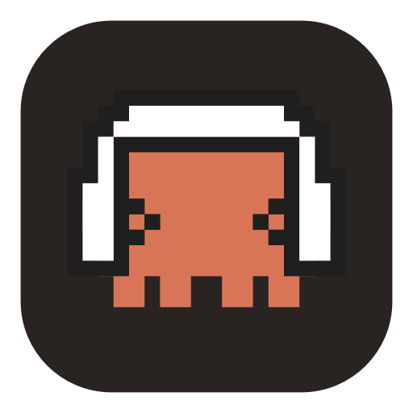

<div align="center">

<a href="https://github.com/thebigdatacomp/meetmd/actions/workflows/ci.yml"></a>


<br><br>



<h1>MeetMD</h1>

<p><strong>Your meetings become Markdown — local, private, ready for Claude.</strong><br>
Captures the meeting audio, transcribes it <strong>on your machine</strong> (the audio never leaves) and writes a structured transcript into a directory Claude reads.</p>

<a href="https://github.com/thebigdatacomp/meetmd/releases/latest"></a>

</div>

---

## Why

Transcription runs **locally** with whisper.cpp (Metal) — no sending meeting audio to a third-party cloud. The output is **Markdown** in a directory of your project, so Claude (or any LLM) can summarize, extract action items, and cross-reference your other docs.

- 🔒 **100% local** — the audio never leaves your machine
- 🎙️ **Everyone in the call** — captured at the OS level (loopback), browser-agnostic (even desktop apps)
- 🗣️ **Diarization** You vs. Participants (your mic on a separate channel)
- 📝 **Quick voice note** — mic only, no screen-recording permission
- 🧠 **Ready for Claude** — open the folder and ask for a summary / action items

## How it works

```
┌──────────────┐     start/stop + metadata       ┌──────────────────────┐
│  Extension   │ ──────────────────────────────> │   Bridge (Go, local)  │
│  (Meet)      │   POST /sessions  (local HTTP)  │                       │
│  detects the │                                 │  • OS audio loopback   │
│  meeting,    │                                 │    (all participants)  │
│  reads title │                                 │  • whisper.cpp (local) │
│  + people    │                                 │  • writes .md          │
└──────────────┘                                 └──────────┬───────────┘
                                                            │
                                                            v
                                          ~/.meetmd/recordings/meetings/<meeting>/
                                            ├── transcript.md
                                            ├── summary.md   (template)
                                            ├── actions.md   (template)
                                            └── meeting.md   (metadata)
```

The extension **doesn't** capture audio or write files (the browser sandbox forbids it and it would lock you to one browser). The heavy lifting is done by the **local Go bridge**: it captures the system audio (all participants, browser-agnostic), transcribes it with local Whisper, and writes the Markdown structure. Design and tradeoffs in [docs/specs/2026-06-08-architecture.md](docs/specs/2026-06-08-architecture.md).

## Install (macOS · Apple Silicon)

1. **[Download `MeetMD.dmg`](https://github.com/thebigdatacomp/meetmd/releases/latest)** → drag it to **Applications** → open it.
2. The **onboarding** walks you through the 3 permissions: **Screen Recording** (participants), **Microphone** (your voice), **Automation ▸ Safari** (Meet detection).
3. Join a Google Meet in **Safari** (auto-detected) or record manually from the menu-bar icon.

The app is **signed (Developer ID) and notarized** by Apple — it opens with no "unidentified developer" warning. It's **self-contained** (whisper + models + helper in the bundle), so it runs with **no config**.

## Use

- **Auto:** join a Google Meet in Safari → the app asks *"Record?"* → **Record**.
- **Manual:** menu-bar icon → **Start recording**.
- **Voice note:** menu-bar icon → **New voice note** → dictate something (mic only, no screen permission) → **Stop & save note**.
- Output goes to `~/.meetmd/recordings/` (meetings in `meetings/[<project>/]`, notes in `notes/`). Open the folder in Claude and ask for a summary / action items.

## Build from source

> Requires **Apple Silicon**, Go 1.21+ (the 1.25 toolchain is fetched via `GOTOOLCHAIN`) and Swift (Xcode CLT).

```bash
brew install cmake             # to build whisper with Metal
xcode-select --install         # swiftc

./menubar/build-app.sh         # downloads models + whisper, builds static Metal, packages MeetMD.app
open menubar/MeetMD.app
```

The first run downloads the models (~490MB) and compiles whisper (a few minutes); it's cached afterwards. For a **distributable** build (Developer ID + notarization + `.dmg`):

```bash
RELEASE=1 NOTARY_PROFILE=<your-notarytool-profile> ./menubar/build-app.sh
```

Without `RELEASE`, the build is a **dev** build (self-signed/ad-hoc) — perfect for local iteration.

### Dev mode (fast rebuild, no packaging)

```bash
cd bridge && make run
cd menubar && swiftc -O MeetMDBar.swift -o meetmd-bar -framework Cocoa && ./meetmd-bar &
```

## Components

| Component | Stack | Role |
|-----------|-------|------|
| `bridge/` | Go 1.25 | Audio capture (OS loopback), transcription (whisper.cpp Metal), `.md` writing, local HTTP |
| `menubar/` | Swift (AppKit) | Menu-bar app + capture helper (ScreenCaptureKit) |
| `extension/` | WebExtension (MV3) | Detects Meet, reads title/participants from the DOM, triggers start/stop |

## Configuration (optional)

The `.app` runs with **no config**. `~/.meetmd/config.yaml` is **not created on install** — it only exists once you save in Settings (or create it by hand), and the paths are derived from **your** home at runtime. Useful keys:

| Key | Default | What for |
|-----|---------|----------|
| `recordings_root` | `~/.meetmd/recordings` | base folder; meetings in `meetings/`, notes in `notes/` |
| `language` | `auto` | transcription language (whisper) |
| `ui_language` | `en` | UI + `.md` output language (`en`, `pt`, or `auto` to follow the OS) |

## Roadmap

- Audio capture on **Windows** (WASAPI) and **Linux** (PipeWire) — macOS only today
- **Voice commands to Claude** (voice → input loop)

## License

[Apache License 2.0](LICENSE) — free to use, modify, and redistribute (including commercially), with a patent grant.
